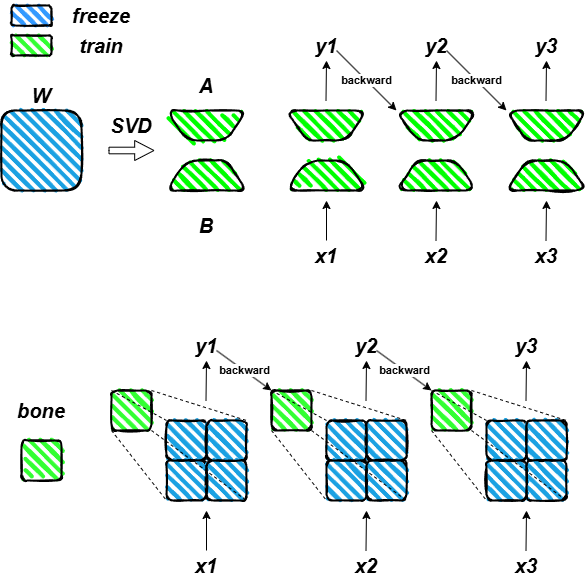

# BONE: BLOCK AFFINE TRANSFORMATION AS PARAMETER EFFICIENT FINE-TUNING METHODS FOR LARGE LANGUAGE MODELS
https://arxiv.org/pdf/2409.15371

## Introduction
Low-Rank Adaptation (LoRA) has achieved remarkable training results by freezing the original weights and training only low-rank matrices, establishing itself as the predominant fine-tuning method for LLMs. In pursuit of performance closer to full-parameter training, a series of LoRA variants have emerged, such as LoRA+, PISSA, Olora, and LoRA-GA. However, these improvements complicate the initial setup of model training and increase initialization time. More importantly, they overlook the internal interactions of the original weight information. To address these issues, we introduce a novel theory, ``Weight Guide'' aimed at continuously guiding trainable matrices through the original weights during training to enhance the utilization of weight information. Based on this theory, we designed a new PEFT technique called Bone (\textbf{B}l\textbf{o}ck Affi\textbf{ne}), which not only enhances the utilization of original weight information but also emphasizes the internal connections between weights, leading to faster convergence and better data fitting. Experimental comparisons across two different LLM architectures (LLaMA2, RWKV6) and various parameter scales demonstrate that the Bone structure can achieve rapid convergence and superior data fitting without the need for complex initialization. For example, when fine-tuning LLaMA2-7B on the MetaMathQA dataset and validating on GSM8k and math benchmarks, Bone achieved fine-tuning scores of 49.36 and 8.8, respectively, outperforming PISSA by 5.84\% and 1.96\%.
<p float="left">
  
   
</p>

<p>
  
</p>

## How to Run
### HF Model
```
cd llama
sh scripts/run_bone.sh
sh scripts/merge_bone.sh
```
### RWKV Model
```
cd RWKV-PEFT
sh scripts/run_bone.sh
sh scripts/merge_bone.sh
```

## Flash-Bone
coming soon!!!


# Citation
If you find this repo useful, please consider citing our works:
```bib
@misc{kang2024boneblockaffinetransformation,
      title={Bone: Block Affine Transformation as Parameter Efficient Fine-tuning Methods for Large Language Models}, 
      author={Jiale Kang},
      year={2024},
      eprint={2409.15371},
      archivePrefix={arXiv},
      primaryClass={cs.CL},
      url={https://arxiv.org/abs/2409.15371}, 
}
