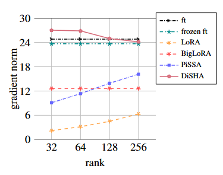
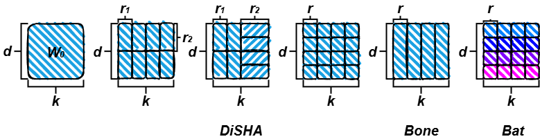
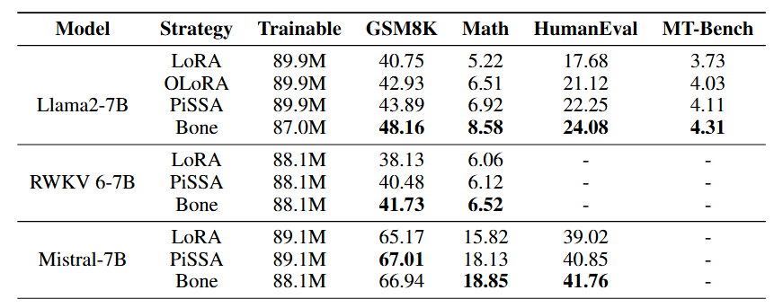

# DiSHA: Dimension-Sharding Adaptation with Fast Convergence and Fast Computation [Paper](https://arxiv.org/pdf/2409.15371)
Old Version: Bone: Block-Affine Adaptation of Large Language Models
## Introduction
Low-Rank Adaptation (LoRA) leverages the low intrinsic rank of weight updates in Large Language Models (LLMs), establishing a Parameter-Efficient Fine-Tuning (PEFT) paradigm. However, LoRA suffers from slow convergence. We introduce Dimension-Sharding Adaptation (DiSHA), which expands the PEFT design space to unlock lower intrinsic ranks and faster convergence by default. Within DiSHA's design space, we propose Block Affine Adaptation (Bone), a computationally efficient structure that delivers both high performance and efficiency. While certain DiSHA configurations may result in colinear updates to weight shards, we address this with Block Affine Transformation Adaptation (BAT), a nonlinear variant of DiSHA. BAT introduces nonlinearity by combining trainable matrices with original weight shards in a nonlinear manner, inducing nonlinearity in matrix updates without introducing additional parameters. Empirical results show that Bone, under the DiSHA framework, consistently outperforms LoRA variants in both NLG and NLU tasks, with significantly improved computational efficiency. Further analysis demonstrates that BAT enhances model capabilities by leveraging its nonlinear design.
<p float="left">
  
   
</p>

### DISHA design space
<p>
  
</p>
### Eval
<p>
  
</p>

## Support by [Huggingface/peft](https://github.com/huggingface/peft.git)

## How to Run
### HF Model
"PEFT-Bone is currently being merged into the official PEFT repository. In the future, you will only need to run 'pip install peft'
```
git clone https://github.com/huggingface/peft.git
cd peft
pip install -e .
```
```
git clone https://github.com/JL-er/Bone.git
```
```
cd Bone
sh scripts/run_bone.sh
```
### RWKV Model
```
git clone https://github.com/JL-er/RWKV-PEFT.git
```
You can check the script settings in the Bone/rwkv-ft file and replace them in the RWKV-PEFT/scripts directory.
```
cd RWKV-PEFT
pip install -r requirements.txt
sh scripts/run_bone.sh
sh scripts/merge_bone.sh
```
# Advanced Usage
```
import torch
import os
from peft import BoneConfig, get_peft_model
from transformers import AutoTokenizer, AutoModelForCausalLM
MODEL_ID = "meta-llama/Llama-2-7b-hf"
model = AutoModelForCausalLM.from_pretrained(MODEL_ID, torch_dtype=torch.bfloat16, device_map="auto")
tokenizer = AutoTokenizer.from_pretrained(MODEL_ID)
tokenizer.pad_token_id = tokenizer.eos_token_id
bone_config = BoneConfig(
    r=64,
    target_modules=["q_proj", "o_proj", "k_proj", "v_proj", "gate_proj", "up_proj", "down_proj"],
    task_type="CAUSAL_LM",
)
peft_model = get_peft_model(model, bone_config)
peft_model.print_trainable_parameters()
OUTPUT_DIR="Bone-Llama-2-7b-hf-r64"
# Save Bone modules:
peft_model.peft_config["default"].init_lora_weights = True # Important
peft_model.save_pretrained(OUTPUT_DIR)
# Save residual model:
peft_model = peft_model.unload()
peft_model.save_pretrained(OUTPUT_DIR)
# Save the tokenizer:
tokenizer.save_pretrained(OUTPUT_DIR)
```

# Citation
If you find this repo useful, please consider citing our works:
# Citation
```bib
@misc{kang2024boneblockaffineadaptationlarge,
      title={Bone: Block-Affine Adaptation of Large Language Models}, 
      author={Jiale Kang},
      year={2024},
      eprint={2409.15371},
      archivePrefix={arXiv},
      primaryClass={cs.CL},
      url={https://arxiv.org/abs/2409.15371}, 
}
