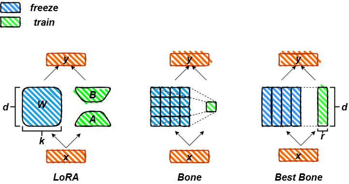

# Bone: Block-Affine Adaptation of Large Language Models [Paper](https://arxiv.org/pdf/2409.15371)

## Introduction
Low-Rank Adaptation (LoRA) has achieved remarkable training results by freezing the original weights and training only low-rank matrices, establishing itself as the predominant fine-tuning method for LLMs. Many LoRA variants have emerged, yet they lack a design tailored to the characteristics of LLM weights and fail to leverage the original weights effectively. To address the sparsity of LLM weights, and drawing inspiration from GQA and MQA, we propose Block-Affine Adaptation (Bone), a novel PEFT technique distinct from LoRA. By dividing the original weights into multiple subspaces that share a single matrix for weight updates, Bone simplifies the process by requiring the trainable matrix to be initialized to zero, eliminating the need for complex initialization as in some LoRA variants. Compared to LoRA, Bone significantly reduces memory usage and achieves faster computation. Evaluation of both NLU and NLG tasks demonstrates that Bone substantially outperforms LoRA and its variants. Inspired by Pissa, we propose a new theory called 'Weight Guide' to better utilize the information embedded in the original weights. This approach extracts valuable information through a linear transformation of the original weight matrix using a trainable matrix. To validate the effectiveness of 'Weight Guide' we combined it with Bone to create a new structure called Block-Affine Transformation (Bat), and ablation experiments confirmed the effectiveness of 'Weight Guide'.
<p float="left">
  
   
</p>

<p>
  
</p>

## Support by [Huggingface/peft](https://github.com/huggingface/peft.git)

## How to Run
### HF Model
"PEFT-Bone is currently being merged into the official PEFT repository. In the future, you will only need to run 'pip install peft'
```
git clone https://github.com/huggingface/peft.git
cd peft
pip install -e .
```
```
git clone https://github.com/JL-er/Bone.git
```
```
cd Bone
sh scripts/run_bone.sh
```
### RWKV Model
```
git clone https://github.com/JL-er/RWKV-PEFT.git
```
You can check the script settings in the Bone/rwkv-ft file and replace them in the RWKV-PEFT/scripts directory.
```
cd RWKV-PEFT
pip install -r requirements.txt
sh scripts/run_bone.sh
sh scripts/merge_bone.sh
```
# Advanced Usage
```
import torch
import os
from peft import BoneConfig, get_peft_model
from transformers import AutoTokenizer, AutoModelForCausalLM
MODEL_ID = "meta-llama/Llama-2-7b-hf"
model = AutoModelForCausalLM.from_pretrained(MODEL_ID, torch_dtype=torch.bfloat16, device_map="auto")
tokenizer = AutoTokenizer.from_pretrained(MODEL_ID)
tokenizer.pad_token_id = tokenizer.eos_token_id
bone_config = BoneConfig(
    r=64,
    target_modules=["q_proj", "o_proj", "k_proj", "v_proj", "gate_proj", "up_proj", "down_proj"],
    task_type="CAUSAL_LM",
)
peft_model = get_peft_model(model, bone_config)
peft_model.print_trainable_parameters()
OUTPUT_DIR="Bone-Llama-2-7b-hf-r64"
# Save Bone modules:
peft_model.peft_config["default"].init_lora_weights = True # Important
peft_model.save_pretrained(OUTPUT_DIR)
# Save residual model:
peft_model = peft_model.unload()
peft_model.save_pretrained(OUTPUT_DIR)
# Save the tokenizer:
tokenizer.save_pretrained(OUTPUT_DIR)
```

# Citation
If you find this repo useful, please consider citing our works:
# Citation
```bib
@misc{kang2024boneblockaffineadaptationlarge,
      title={Bone: Block-Affine Adaptation of Large Language Models}, 
      author={Jiale Kang},
      year={2024},
      eprint={2409.15371},
      archivePrefix={arXiv},
      primaryClass={cs.CL},
      url={https://arxiv.org/abs/2409.15371}, 
}
