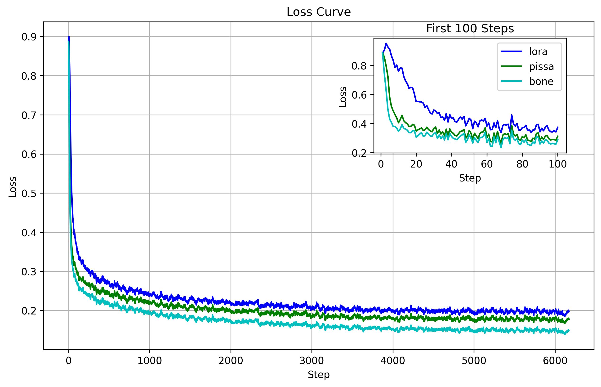
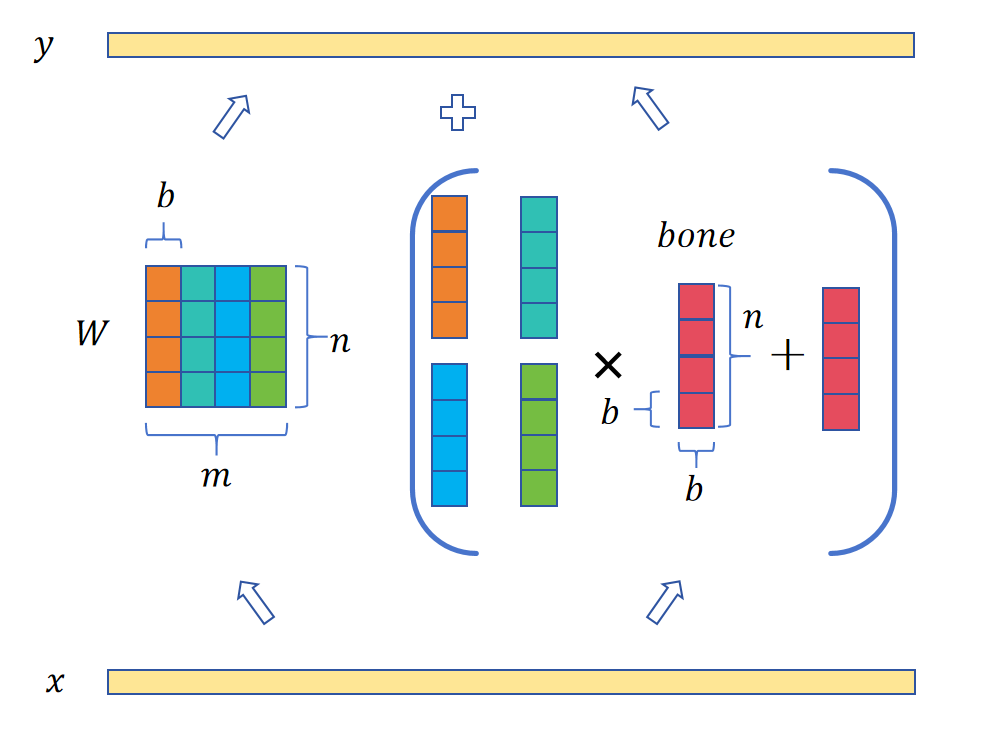
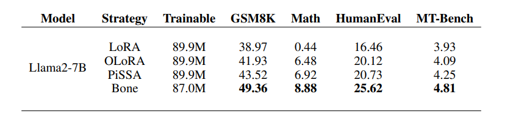

# Bone: BLOCK AFFINE OF LARGE LANGUAGE MODELS
<p float="left">
  
   
</p>

<p>
  
</p>

## How to Run
### HF Model
```
cd llama
sh scripts/run_bone.sh
sh scripts/merge_bone.sh
```
### RWKV Model
```
cd RWKV-PEFT
sh scripts/run_bone.sh
sh scripts/merge_bone.sh
```

## Flash-Bone
coming soon!!!


# Citation
If you find this repo useful, please consider citing our works:
```bib
@misc{kang2024boneblockaffinetransformation,
      title={Bone: Block Affine Transformation as Parameter Efficient Fine-tuning Methods for Large Language Models}, 
      author={Jiale Kang},
      year={2024},
      eprint={2409.15371},
      archivePrefix={arXiv},
      primaryClass={cs.CL},
      url={https://arxiv.org/abs/2409.15371}, 
}
